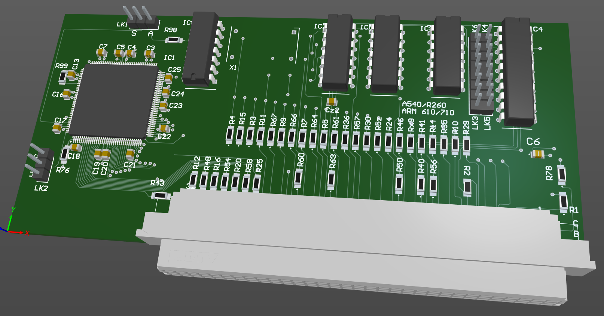

# Acorn A540/R260 Arm6 (Arm610/Arm710) processor card

May 2025

For playing with Arm610/Arm710 in A540.  Uses the derived synchronous clock generation from my reverse engineering of the Arm600 card, but allows switch to onboard asynchronous oscillator too.

This has NOT been built or tested yet.

## Licence

No warranty is provided, and this work is used at your own risk.  

Licenced as CC BY-SA 4.0

Copyright 2025 Ian Jeffray

